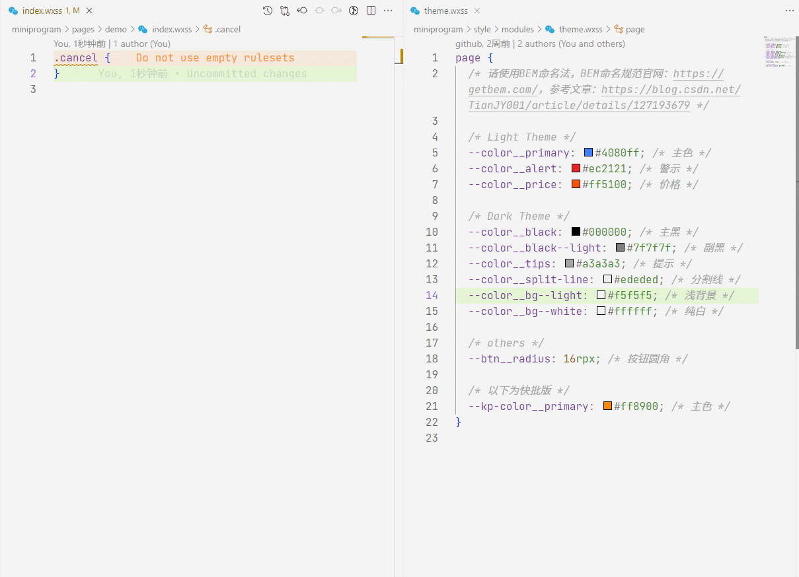

# 这是一个 vscode 扩展，用于微信小程序 `wxml` 与 `wxss` `双向类名提示；wxss` 中提示全局样式 `page` 标签定义的变量；为 `wxml` 文件增加符号表

- 在 `wxss `文件中键入`.`时自动提示同名 `wxml` 文件中定义的类名
- 在 `wxss` 文件中键入 `var(`时自动提示全局样式中 `page` 标签里面定义的样式变量名
- 在 `wxml` 文件中写 `class` 属性时，自动提示同名 `wxss` 文件中定义的类名（包括全局 `app.wxss` 和 wxss 中通过`@import` 引入的其它 wxss 文件中的定义的类名）
- 为 `wxml` 增加符号表，按 `ctrl+shift+o`快捷键时会显示当前 `wxml` 文件的符号表，此时可输入`标签名`或`类名`或 `id名` 或`事件绑定名`快速跳转到对应位置

详见以下截图：

