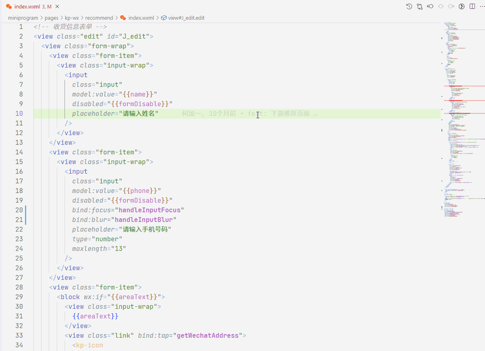

# 这是一个 vscode 扩展，用于微信小程序 wxml 与 wxss 双向类名提示，以及为 wxml 增加符号表

- 在 `wxss `文件中键入`.`时自动提示同名 `wxml` 文件中定义的类名
- 在 `wxml` 文件中写 `class` 属性时，自动提示同名 `wxss` 文件中定义的类名（包括全局 `app.wxss` 和 wxss 中通过`@import` 引入的其它 wxss 文件中的定义的类名）
- 为 `wxml` 增加符号表

详见以下截图：

